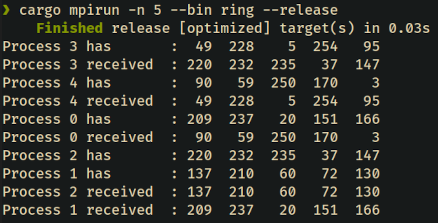

# HW3: Ring

## Summary

Using MPI, each process generates five random ints, `u8`. Each process then prints a message describing their generated values (e.g. `Process 3 has: 4 100 87 45 4`).

Each process then sends their generated values to the process one rank higher, with the highest rank process sending to the lowest. Then each process prints their received values, similar to before.

Do not use barriers and ensure that the program can't deadlock. The output should be formatted so as to appear columnar.

## Commands

To run with five processes:

```bash
cargo mpirun -n 5 --bin ring --release
```

Output:


